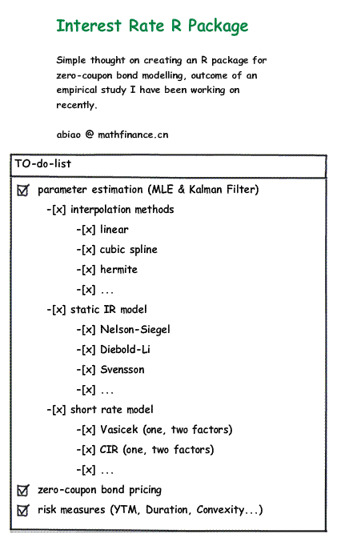

# fixedincome

- CHECK create interest rate curve
- CHECK append rates to an interest rate curve
- InterestRate class
	- rate
	- Compounding
	- DayCount
	- Frequency
- CHECK implement indexes
- CHECK test curve size
- CHECK test curve's rates and terms sizes
- CHECK set interpolation to curve, as an attribute: why interpolate explicitly when the curve knows which interpolation it should use
- vectorized operations for SpotRate functions
- functions to sum a Curve
- function to shift a curve
- CHECK plot interest rate
- CHECK as.data.frame.SpotRateCurve
- other interpolation methods
	- CHECK Linear
	- LogLinear
	- CHECK Monotone Cubic Spline (Hyman)
	- CHECK Hermite
	- CHECK Natural Spline
	- Constrained Spline

		interp.Linear <- function(object, ...) UseMethod('interp.Linear', object)
		interp.LogLinear <- function(object, ...) UseMethod('interp.LogLinear', object)
		interp.CubicSpline <- function(object, ...) UseMethod('interp.CubicSpline', object)
		interp.Linear.SpotRateCurve <- function(curve, term) {
		    if ( any( idx <- curve$terms == term ) ) {
		        return(curve$rates[idx])
		    } else {
		        idx.u <- min(which(curve$terms > term))
		        idx.d <- max(which(curve$terms < term))
		        ir.u <- SpotRate(curve$rates[idx.u], curve$terms[idx.u])
		        ir.d <- SpotRate(curve$rates[idx.d], curve$terms[idx.d])
		        ir.fwd <- forward.rate(ir.d, ir.u)
		        # use forward rate with new term
		        ir.fwd.adj <- as.SpotRate(ir.fwd, term-term(ir.d))
		        new.cf <- as.CompoundFactor(ir.d) * as.CompoundFactor(ir.fwd.adj)
		        return( rate(as.SpotRate(new.cf)) )
		    }
		}
		print.SpotRateCurve <- function(curve) {
		}

