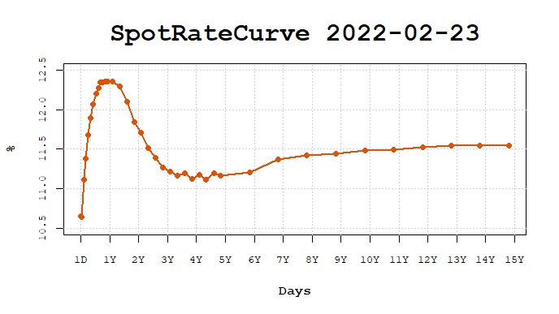
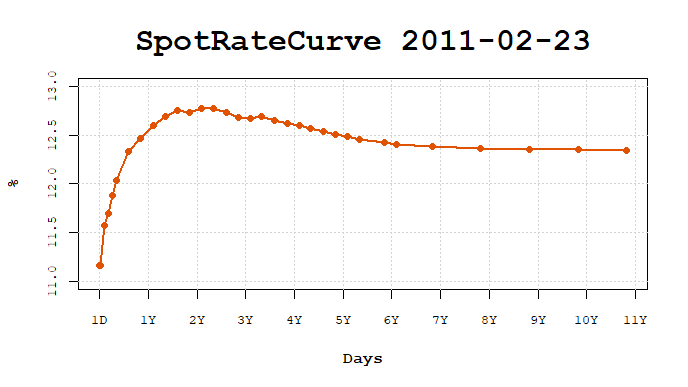
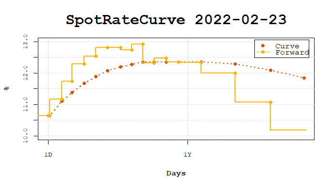
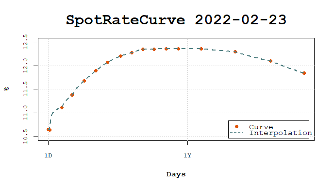
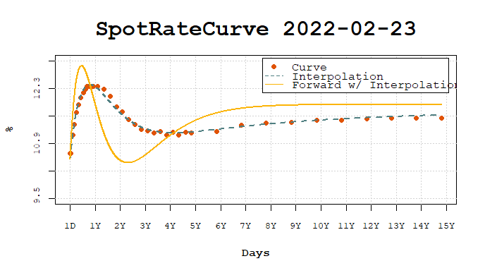
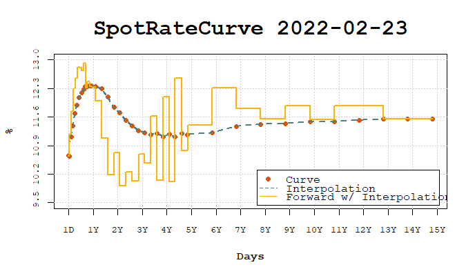
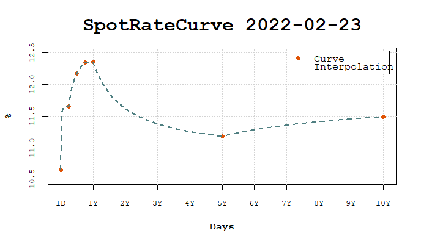

# fixedincome

Calculations involving interest rates are usually very easy and straightforward,
but sometimes it involves specific issues that makes the task of writing
structured and reproducible code for it chalenging and annoying.
The `fixedincome` package brings many functions to strucutre and create
facilities to handle with interest rates, term structure of interest rates and
specific issues regarding compounding rates and day count rules, for example.

Below there are a few examples on how to create and make calculations with
interest rates using `fixedincome`.

## Examples

To create an interest rate we need to specify 4 elements:

- the value of the interest rate itself, a decimal number
- the compounding regime of interest rate, that can be `simple`, `discrete` or
`continuous`.
- the day count rule which defines how interest is accrued over time, we have a
few options, for example, `actual/360` where the days between two dates
are calculated as the difference and the year is assumed to be 360 days.
- the calendar used to count the number of days between two dates,
we have `actual` calendar that compute the difference between two dates.

There is another important topic that wasn't declared here that is the
*frequency* of interest.
To start with the things simple `fixedincome` handles only with *annual* rates
since this represents the great majority of rates used in financial market 
contracts, but this restriction can be reviewed in the future.

Given that let's declare an annual spot rate with a `simple` compounding, an
`actual/360` and the `actual` calendar.

```r
library(fixedincome)
sr <- spotrate(0.06, "simple", "actual/360", "actual")
sr
#> [1] "0.06 simple actual/360 actual"
```

Compound the spot rate for 7 months.

```r
compound(sr, 7, "months")
#> [1] 1.035
```

Also compound using dates.

``` r
compound(sr, as.Date("2022-02-23"), as.Date("2022-12-28"))
#> [1] 1.051333
```

Spot rates can be put inside data.frames.

```r
library(dplyr)
library(fixedincome)

df <- tibble(
  rate = spotrate(rep(10.56 / 100, 5),
                  compounding = "discrete",
                  daycount = "business/252",
                  calendar = "Brazil/ANBIMA"),
  terms = term(1:5, "years")
)

df
#> # A tibble: 5 x 2
#>   rate                                       terms  
#>   <SpotRate>                                 <Term> 
#> 1 0.1056 discrete business/252 Brazil/ANBIMA 1 year 
#> 2 0.1056 discrete business/252 Brazil/ANBIMA 2 years
#> 3 0.1056 discrete business/252 Brazil/ANBIMA 3 years
#> 4 0.1056 discrete business/252 Brazil/ANBIMA 4 years
#> 5 0.1056 discrete business/252 Brazil/ANBIMA 5 years
```

The tidyverse verbs can be easily used with `SpotRate` and `Term` classes.

```r
df |> mutate(fact = compound(rate, terms))
#> # A tibble: 5 x 3
#>   rate                                       terms    fact
#>   <SpotRate>                                 <Term>  <dbl>
#> 1 0.1056 discrete business/252 Brazil/ANBIMA 1 year   1.11
#> 2 0.1056 discrete business/252 Brazil/ANBIMA 2 years  1.22
#> 3 0.1056 discrete business/252 Brazil/ANBIMA 3 years  1.35
#> 4 0.1056 discrete business/252 Brazil/ANBIMA 4 years  1.49
#> 5 0.1056 discrete business/252 Brazil/ANBIMA 5 years  1.65
```

### Spot rate curves

Let's create a spot rate curve using web scraping (from B3 website)

```r
source("examples/copom-functions.R")
curve <- get_curve_from_web("2022-02-23")
curve
#>           SpotRateCurve
#> 1 day            0.1065
#> 3 days           0.1064
#> 25 days          0.1111
#> 44 days          0.1138
#> 66 days          0.1168
#> 87 days          0.1189
#> 108 days         0.1207
#> 131 days         0.1220
#> 152 days         0.1227
#> 172 days         0.1235
#> ... with 29 more rows
#> discrete business/252 Brazil/ANBIMA
#> Reference date: 2022-02-23
```

`SpotRateCurve` plots can be easily done by calling `plot`.

```{r}
plot(curve)
```


For another date.

```r
curve <- get_curve_from_web("2011-02-23")
plot(curve)
```


It can show the forward rates for the short term by selecting the first two years.

```r
curve <- get_curve_from_web("2022-02-23")
plot(first(curve, "2 years"), show_forward = TRUE)
```



Once interpolation is set, it can be used in the plot.

```r
interpolation(curve) <- interp_flatforward()
plot(first(curve, "2 years"), use_interpolation = TRUE, legend_location = "bottomright")
```



Parametric models like the Nelson-Siegel-Svensson model can be fitted to the curve.

```r
interpolation(curve) <- fit_interpolation(
  interp_nelsonsiegelsvensson(0.01, 0.01, 0.01, 0.01, 0.01, 0.01), curve)

interpolation(curve)
#> <Interpolation: nelsonsiegelsvensson> 
#> Parameters:
#>   beta1   beta2   beta3   beta4 lambda1 lambda2 
#>  0.1189 -0.0142  0.1378 -0.1127  0.0064  0.0038 
```

Once set to the curve it is used in the plot to show daily forward rates.

```r
plot(curve, use_interpolation = TRUE, show_forward = TRUE)
```



The interpolation can be changed in order to compare different interpolations
and the effects in forward rates.

```r
interpolation(curve) <- interp_flatforward()
plot(curve, use_interpolation = TRUE, show_forward = TRUE, legend_location = "bottomright")
```



Interpolation enables the creation of standardized curves, commonly used in 
risk management to build risk factors.

```r
risk_terms <- c(1, c(3, 6, 9) * 21, c(1, 5, 10) * 252)
risk_curve <- curve[[risk_terms]]
plot(risk_curve, use_interpolation = TRUE)
```


